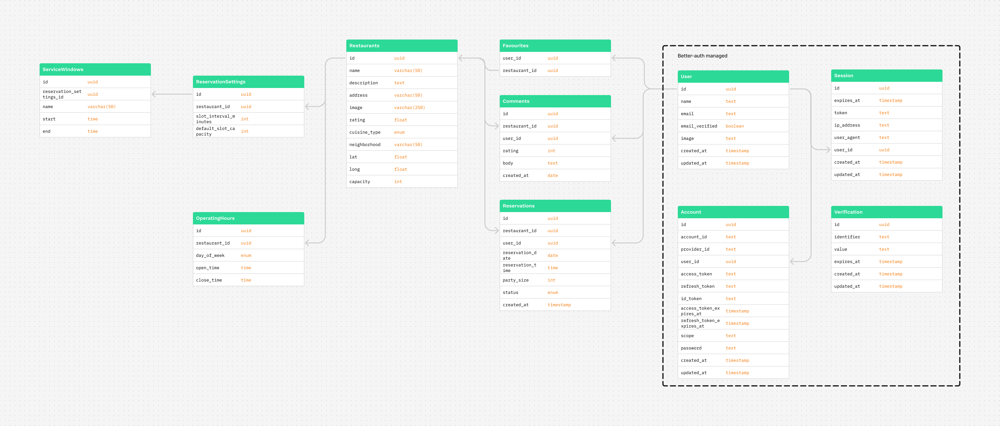

# Restaurant Booker Documentation

## Overview

Restaurant Booker is a full-stack app to browse restaurants, check availability, create/cancel reservations, manage favourites, and post comments.

This monorepo uses Turborepo and contains:

- `apps/web`: Next.js frontend
- `apps/api`: Express + TypeScript backend
- `packages/*`: shared config/packages

Project management is handled with GitHub Projects and issues. The project board is at [GitHub Project - Restaurant Booker](https://github.com/users/Davidrodrguez98/projects/2)

## Tech Stack and Architecture

- Frontend: Next.js (App Router), React, Tailwind CSS
- Backend: Express, Drizzle ORM, Better Auth, Zod, Swagger
- Database: Neon + PostgreSQL
- Monorepo tooling: pnpm + Turborepo
- Deployment/runtime: Docker + Docker Compose

## Core Functional Scope

- Authentication: sign-up, sign-in, sign-out
- Restaurants: list, detail, availability, create, update, delete
- Reservations: list mine, detail, create, cancel
- Comments: list/create by restaurant, update/delete by comment
- Favourites: list mine, add/remove restaurant

## Database Schema



## API Endpoint Summary

```txt
POST   /api/auth/sign-up/email
POST   /api/auth/sign-in/email
POST   /api/auth/sign-out

GET    /api/restaurants
GET    /api/restaurants/:id
GET    /api/restaurants/:id/availability?date=YYYY-MM-DD&partySize=N
POST   /api/restaurants
PATCH  /api/restaurants/:id
DELETE /api/restaurants/:id

GET    /api/me/favourites
POST   /api/me/favourites/:restaurantId
DELETE /api/me/favourites/:restaurantId

GET    /api/restaurants/:id/comments
POST   /api/restaurants/:id/comments
PATCH  /api/comments/:id
DELETE /api/comments/:id

GET    /api/reservations/me
GET    /api/reservations/:id
POST   /api/reservations
PATCH  /api/reservations/:id/cancel
```

## Important Implementation Notes

- Auth flow in this project:
  1. Frontend calls `POST /api/auth/sign-in/email` with email and password.
  2. Backend validates with Better Auth.
  3. Frontend sends authenticated requests to API.
- `GET /api/me/favourites` returns full restaurant objects to avoid extra frontend fetches and reduce client-side filtering complexity.
- Restaurant create form intentionally leaves `image` less strictly validated on frontend to demonstrate backend validation/error handling.

## Local Development

### Requirements

- Node.js >= 20
- pnpm >= 11.9.0
- Docker + Docker Compose (optional, for containerized run)

### 1) Install dependencies

```sh
pnpm install
```

### 2) Create env files

Create `apps/api/.env` with:

- `DATABASE_URL`
- `DATABASE_URL_UNPOOLED`
- `BETTER_AUTH_SECRET`
- `BETTER_AUTH_URL`

Create `apps/web/.env` with:

- `NEXT_PUBLIC_API_URL`

### 3) (Optional) Run migrations and seed database

```sh
cd apps/api && pnpm drizzle-kit migrate && bun run ./src/db/seed.ts
```

### 4) Start development

```sh
pnpm run dev
```

Local URLs:

- Frontend: http://localhost:3000
- API: http://localhost:3001

Test user:

- email: `test@test.com`
- password: `12345678`

## Build and Test

From repository root:

```sh
pnpm build
pnpm test
```

API only:

```sh
pnpm --filter api test
```

## Docker Run

If `docker-compose.yml` uses external network `app_network`, create it first:

```sh
docker network create app_network
```

Build and start:

```sh
docker-compose -f docker-compose.yml build
docker-compose -f docker-compose.yml up -d
```

Stop:

```sh
docker-compose -f docker-compose.yml down
```

## Validation and Error Handling Contract

- Validate all `body`, `query`, and `params` inputs with Zod before service logic.
- Validation failures are normalized into a client-friendly response with:
  - `error`: a generic summary (`"Invalid request data"`)
  - `details`: field-level validation errors derived from Zod issues
- Field paths are returned in dot notation (for example `body.image`) so frontend forms can map errors directly to inputs.
- Return `400` for invalid input.
- Return `404` for missing resources.
- Return `409` for booking conflicts.
- Return `500` only for unexpected errors.

Example error format:

```json
{
	"error": "Invalid request data",
	"details": [
		{
			"field": "body.image",
			"message": "Invalid input: expected string, received undefined"
		}
	]
}
```

## Booking Rules to Keep in Mind

- No bookings in the past.
- Party size must be valid and positive.
- Time slot capacity must fit party size.
- No overlapping reservations on the same time slot.
- Cancelled reservations must not block future availability.
- Availability should be computed from schedule, capacity, and existing reservations.
- Reservation creation should be transaction-safe to avoid race conditions.

## AI Usage Disclosure

AI tools used during development:

- GitHub Copilot
- v0

Used for:

- technology selection and boilerplate acceleration
- migration from yarn to pnpm in turborepo/docker setup
- debugging setup issues and small refactors
- initial frontend scaffolding and iterative code improvements
- documentation and README generation
- code refactoring
- Replace yarn with pnpm in turborepo/docker setup and fix related issues
- Circular dependency issues in database schemas.

Rejected AI output:

- repetitive code that was replaced by extracted/shared functions

Important reviewed AI output:

- concurrency-safe reservation creation logic
- database seeding scripts
- API error handling and validation patterns
- unit tests
- Zod validations
- file/folder organization and separation of concerns
- frontend template from v0 for Next.js app

The `AGENTS.md` file is included at the root of the repository.

## Future Improvements

- Email notifications for booking confirmations and cancellations.
- Online payment integration for booking deposits with Stripe.
- Role-based access control and admin panel for restaurant owners to manage availability and view bookings.
- Pagination for restaurant list, comments and booking history.
- Server-side filtering and sorting options for restaurants.
- When app is deployed, a static IP must be configured and included in a white list in the database configuration in order to allow access only from that IP.
- Create/edit reservation settings and service windows for restaurants.
- Add i18n support for multiple languages and locales.
- Restaurant map integration with Google Maps for location display and directions using latitude and longitude fields.
